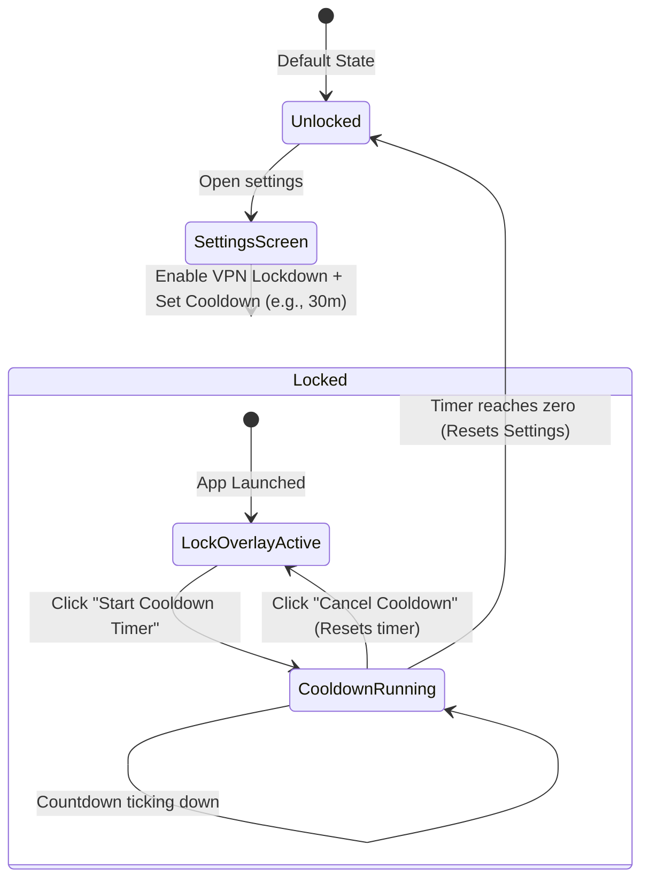

# BlockAds Feature Specification: VPN Timer Lock (Lockdown Mode)

This document specifies the technical design, workflow, code changes, and edge-case handling for the **VPN Lockdown Mode & Cooldown Timer** feature.

---

## 🎯 Feature Overview & Motivation

For users dealing with digital addictions (such as gambling, social media, shopping, or adult content), the standard ad-blocker suffers from an architectural limitation: **the user can easily turn it off during a moment of weakness.** In a split second, an impulsive urge can lead the user to open settings, whitelist a domain, or disable the VPN entirely, bypassing their own self-imposed protection.

The **VPN Timer Lock (Lockdown Mode)** introduces **cognitive friction** to interrupt this immediate feedback/reward loop. By locking down settings and disabling direct shutdown switches, the app forces a delayed cooling-off period. To disable the protection, the user must initiate a countdown (e.g., 30 minutes). During this time, they cannot browse blocked sites, but they are given time to cool down, self-reflect, and ideally let the superficial urge pass.

---

## 🔄 User Experience (UX) Flow



1. **Enabling Lockdown**:
   - The user opens [`SettingsScreen.kt`](file:///home/lucky/Development/blockads-android/app/src/main/java/app/pwhs/blockads/ui/settings/SettingsScreen.kt) and navigates to the new **Impulse Control & Lockdown** section.
   - They toggle **VPN Lockdown** ON and select a **Cooldown Timer Duration** from the options: `1m, 5m, 10m, 30m, 1h, 6h, 12h, 24h`.
   - Upon enabling, the VPN service is immediately started (if off) and the app goes into **Lockdown Mode**.

2. **Locked State Operations**:
   - The user **cannot** toggle the VPN switch OFF. Clicking the dashboard power toggle, app widgets, Tasker commands, or Quick Settings tiles is intercepted and ignored.
   - When the user opens the BlockAds app, a full-screen **Lockdown Overlay** blocks the rest of the application (excluding Splash & Onboarding). They cannot view or modify filter lists, whitelist apps, change DNS providers, or access settings.
   - The overlay displays a prominent message: *"BlockAds is locked. To modify your settings or disable ad blocking, you must initiate the cooldown timer."*

3. **Timer Unlocking Flow**:
   - The user clicks **"Start Cooldown Timer"** on the Lockdown Overlay.
   - A timer begins counting down from their chosen duration (e.g., 30:00, 29:59...).
   - **Important**: At any point during the countdown, the user has a **"Cancel Cooldown"** button. If clicked, the timer is immediately aborted, resetting the countdown back to the full duration and returning the app to the initial locked state.
   - If the timer completes successfully (reaches zero), the lockdown state is deactivated. The app reverts to the standard **Unlocked** state, allowing modifications or VPN toggle control.

---

## 🛠️ Technical Design & Code Mapping

To ensure a foolproof lockdown, we must intercept VPN shutdown actions across all entry points and enforce the lockout screen overlay.

### 1. Data Layer Configuration
We introduce three state variables in [`AppPreferences.kt`](file:///home/lucky/Development/blockads-android/app/src/main/java/app/pwhs/blockads/data/datastore/AppPreferences.kt):

```kotlin
// AppPreferences.kt additions
val lockdownEnabled: Flow<Boolean> = dataStore.data.map { it[LOCKDOWN_ENABLED] ?: false }
val lockdownDuration: Flow<Long> = dataStore.data.map { it[LOCKDOWN_DURATION] ?: 300000L } // default 5 minutes
val cooldownStartTimestamp: Flow<Long> = dataStore.data.map { it[COOLDOWN_START_TIMESTAMP] ?: 0L }

suspend fun setLockdownEnabled(enabled: Boolean) {
    dataStore.edit { it[LOCKDOWN_ENABLED] = enabled }
}
suspend fun setLockdownDuration(ms: Long) {
    dataStore.edit { it[LOCKDOWN_DURATION] = ms }
}
suspend fun setCooldownStartTimestamp(timestamp: Long) {
    dataStore.edit { it[COOLDOWN_START_TIMESTAMP] = timestamp }
}
```

### 2. Lockout UI Overlay (Compose root)
To prevent the user from accessing setting views, we overlay a Compose layout at the root container [`BlockAdsApp.kt`](file:///home/lucky/Development/blockads-android/app/src/main/java/app/pwhs/blockads/ui/BlockAdsApp.kt).

```kotlin
// BlockAdsApp.kt UI layout composition
@Composable
fun BlockAdsApp(...) {
    val appPrefs: AppPreferences = koinInject()
    val isLocked by appPrefs.lockdownEnabled.collectAsState(initial = false)
    val cooldownStart by appPrefs.cooldownStartTimestamp.collectAsState(initial = 0L)
    val duration by appPrefs.lockdownDuration.collectAsState(initial = 300000L)

    Box(modifier = Modifier.fillMaxSize()) {
        // Main App Navigation
        NavDisplay(backStack = backStack, ...)

        // Root Lockdown Overlay
        if (isLocked) {
            LockdownScreen(
                cooldownStart = cooldownStart,
                duration = duration,
                onStartCooldown = { timestamp ->
                    coroutineScope.launch { appPrefs.setCooldownStartTimestamp(timestamp) }
                },
                onCancelCooldown = {
                    coroutineScope.launch { appPrefs.setCooldownStartTimestamp(0L) }
                },
                onUnlockComplete = {
                    coroutineScope.launch {
                        appPrefs.setLockdownEnabled(false)
                        appPrefs.setCooldownStartTimestamp(0L)
                    }
                }
            )
        }
    }
}
```

#### LockdownScreen Ticker Logic
Inside `LockdownScreen`, a timer checks the duration dynamically:
```kotlin
@Composable
fun LockdownScreen(
    cooldownStart: Long,
    duration: Long,
    onStartCooldown: (Long) -> Unit,
    onCancelCooldown: () -> Unit,
    onUnlockComplete: () -> Unit
) {
    var currentTime by remember { mutableStateOf(System.currentTimeMillis()) }
    
    // LaunchedEffect ticker running every 1 second
    LaunchedEffect(cooldownStart) {
        if (cooldownStart > 0L) {
            while (true) {
                currentTime = System.currentTimeMillis()
                val elapsed = currentTime - cooldownStart
                if (elapsed >= duration) {
                    onUnlockComplete()
                    break
                }
                delay(1000L)
            }
        }
    }
    
    // Calculate remaining seconds
    val remainingMs = if (cooldownStart > 0L) duration - (currentTime - cooldownStart) else duration
    val secondsLeft = (remainingMs / 1000).coerceAtLeast(0)

    // Render lockdown UI, warnings, lock icons, progress bar, and trigger buttons...
}
```

### 3. Service Lifecycle Guarding (Failsafe)
We prevent external or programmatic stop commands inside [`AdBlockVpnService.kt`](file:///home/lucky/Development/blockads-android/app/src/main/java/app/pwhs/blockads/service/AdBlockVpnService.kt) and [`RootProxyService.kt`](file:///home/lucky/Development/blockads-android/app/src/main/java/app/pwhs/blockads/service/RootProxyService.kt):

```kotlin
// Inside AdBlockVpnService.onStartCommand / stopVpn checks
override fun onStartCommand(intent: Intent?, flags: Int, startId: Int): Int {
    if (intent?.action == ACTION_STOP) {
        val isLocked = runBlocking { appPrefs.lockdownEnabled.first() }
        if (isLocked) {
            Timber.w("Stop request ignored: VPN is in Lockdown Mode.")
            return START_STICKY
        }
    }
    // standard command routing...
}
```

Similarly, in [`ServiceController.kt`](file:///home/lucky/Development/blockads-android/app/src/main/java/app/pwhs/blockads/service/ServiceController.kt), prevent calling stop functions if lockdown is active.

### 4. Integration Broadcasts & Interceptors
We intercept requests from remote widgets, Tasker, and tiles:
- **Quick Settings Tile ([`AdBlockTileService.kt`](file:///home/lucky/Development/blockads-android/app/src/main/java/app/pwhs/blockads/service/AdBlockTileService.kt))**:
  Check `lockdownEnabled` snapshot inside `onClick()`. If locked, block state changes, keep tile `Tile.STATE_ACTIVE`, and dispatch a system status notification stating: *"BlockAds VPN is locked. Open the app to begin the unlock cooldown."*
- **App Widgets ([`WidgetToggleReceiver.kt`](file:///home/lucky/Development/blockads-android/app/src/main/java/app/pwhs/blockads/widget/WidgetToggleReceiver.kt))**:
  Inside `toggleVpn`, check lockdown preferences. If locked, abort stop, trigger a status notification, and send update broadcasts to keep the widget UI showing active.
- **Tasker Automation ([`TaskerReceiver.kt`](file:///home/lucky/Development/blockads-android/app/src/main/java/app/pwhs/blockads/receiver/TaskerReceiver.kt))**:
  Check lockdown status when receiving `ACTION_STOP`. Ignore the broadcast to maintain active filtering.

---

## 🛡️ Edge Cases & Handling Mitigations

### 1. Clock Manipulation (Time Tampering)
*Scenario*: The user starts a 12-hour cooldown timer and then shifts the Android system calendar clock forward 12 hours to force completion.

*Mitigations*:
- **Monotonic Boot Reference**: When a cooldown starts, save the monotonic system time (`SystemClock.elapsedRealtime()`) and the startup epoch. While the app is active, compute elapsed time using `SystemClock.elapsedRealtime()`.
- **Clock Regress Detection**: Periodically persist `lastActiveTimestamp = System.currentTimeMillis()`. If the app launches and the current system time is *earlier* than `lastActiveTimestamp`, time-tampering is detected.
- **Time Jump Detection**: If the difference between subsequent ticks is significantly larger than the delay duration (e.g., a jump of >10 minutes in 1 second), flag time-tampering.
- **Penalty Logic**: Upon detecting time tampering, freeze the countdown timer, reset `cooldownStartTimestamp = 0L` to stop the cooldown, and notify the user that the timer has reset due to time tampering.

### 2. Device Reboots
*Scenario*: The user restarts the device to clean volatile states or break loop checking.

*Mitigations*:
- **Boot Persistence**: The `cooldownStartTimestamp` is stored in the persistent `DataStore` preferences. Reboots do not clear it.
- **System Boot Override ([`BootReceiver.kt`](file:///home/lucky/Development/blockads-android/app/src/main/java/app/pwhs/blockads/service/BootReceiver.kt))**:
  Inside `onReceive`, if `lockdownEnabled` is true, immediately start the filtering VPN service, bypass the `autoReconnect` and `wasEnabled` flags, and enforce the VPN boot sequence.
- **Handling monotonic reset**: Since `SystemClock.elapsedRealtime()` resets to zero on boot, detect if the monotonic reference is lost (boot time has reset) and fall back safely to `System.currentTimeMillis()` for calculation, but re-calculate constraints.

### 3. Settings Bypass via Back Press / Gestures
*Scenario*: The user attempts to dismiss the Lockout screen via back navigation or system gestures.

*Mitigations*:
- The overlay layout uses Compose `BackHandler` which overrides back presses while lockdown is active:
  ```kotlin
  BackHandler(enabled = isLocked) {
      // Do nothing, consuming the back press action entirely
  }
  ```
- Because the overlay is declared outside the navigation stacks inside the root layout in [`BlockAdsApp.kt`](file:///home/lucky/Development/blockads-android/app/src/main/java/app/pwhs/blockads/ui/BlockAdsApp.kt), Android routing keys cannot swap or transition it away.

### 4. TV Platform Limitations
*Scenario*: How does the TV Companion App handle the lock?

*Mitigations*:
- The lock feature is primarily targeted toward mobile devices where personal digital addictions are most prevalent. 
- In the TV app ([`blockadstv`](file:///home/lucky/Development/blockads-android/blockadstv)), we can either synchronize preferences via accounts (if a shared cloud DB exists) or keep the TV app unlocked since system settings access on TV devices is rare and remote navigation is tedious. Mobile-only configuration is recommended for the initial implementation phase.

---

## 📈 Uncontrollable Android System Actions

It is essential to clarify that BlockAds operates within Android's sandboxed environment and standard security model. The following actions **cannot** be blocked by any third-party app:
1. **System VPN Revocation**: The user can manually open Android Settings -> Network -> VPN and toggle OFF the BlockAds VPN or revoke its profile.
2. **Force Stopping the App**: The user can manually navigate to Android Settings -> Apps -> BlockAds and click "Force Stop".
3. **App Uninstallation**: The user can uninstall BlockAds.

*Why this design is still effective*:
Lockdown Mode is not a hardware constraint; it is a **mindfulness and friction mechanism**. It prevents the user from turning off blocking with a single tap inside the app, the notification bar, or the home screen. Forcing the user to manually dive into deep system menus, force-stop components, or uninstall the app increases the friction threshold, which gives the prefrontal cortex enough time to override impulsive urges.
