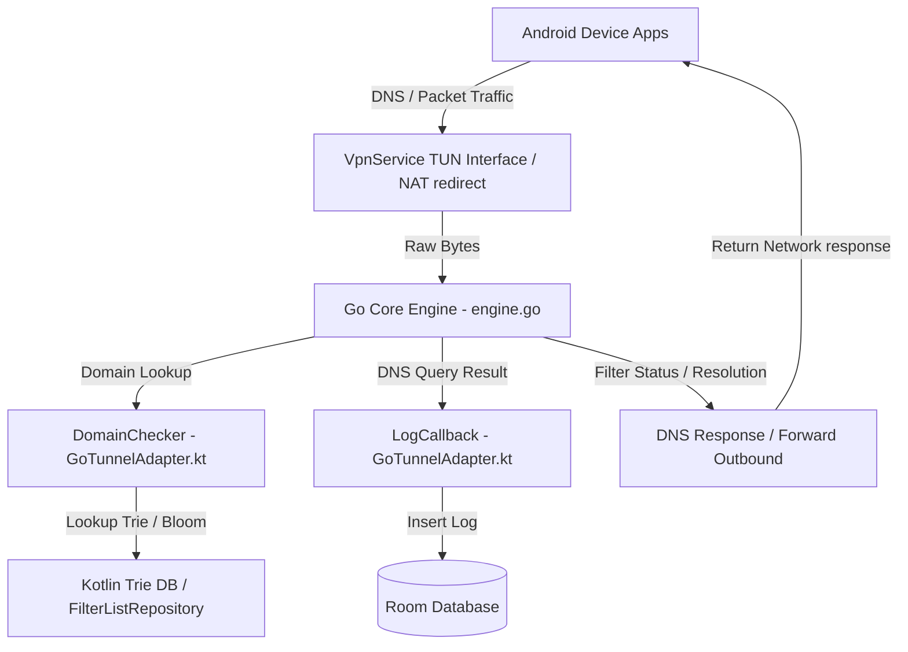

# BlockAds Android Codebase Organization & Architecture

This document maps the architectural structure, features, and key files in the **BlockAds** repository. Use this guide to easily navigate the codebase when implementing new features or debugging existing components.

---

## 🗺️ Project Architecture Overview
BlockAds operates on a **hybrid model**:
- **Go Core Tunnel (`tunnel/`)**: A high-performance network filtering engine compiled into an Android library (`.aar`) using `gomobile`. It implements raw packet parsing, DNS interception, a userspace TCP/IP stack (via gVisor), element-hiding CSS injection, JavaScript scriptlet injection, and WireGuard protocol routing.
- **Kotlin Android Apps**: Handle user settings, Room database persistence, scheduling, and UI logic.
  - **Mobile App (`app/`)**: Full-featured phone app including advanced settings, per-app firewall rules, custom profiles/schedules, statistics charts, and root-level transparent proxying.
  - **TV App (`blockadstv/`)**: Companion Android TV app with a remote-friendly Compose layout.



---

## 📁 Repository Directory Layout

| Directory / File | Description |
| --- | --- |
| [`tunnel/`](file:///home/lucky/Development/blockads-android/tunnel) | Shared Go source files for the DNS/VPN engine. |
| [`app/`](file:///home/lucky/Development/blockads-android/app) | Main mobile Android application codebase (Kotlin). |
| [`blockadstv/`](file:///home/lucky/Development/blockads-android/blockadstv) | Android TV companion application codebase (Kotlin). |
| [`scripts/`](file:///home/lucky/Development/blockads-android/scripts) | Build scripts for compiling the Go tunnel to AAR format. |
| [`docs/`](file:///home/lucky/Development/blockads-android/docs) | Project-specific feature documentations. |
| [`.agent/`](file:///home/lucky/Development/blockads-android/.agent) | Custom developer agent skills and reference architecture manuals. |

---

## 🛠️ Codebase Structure by Sector

### 1. VPN Tunnel & Go-Kotlin Interoperability
This sector routes OS-level network packets to the Go Core Engine and controls the life-cycle of the VPN connection.

- **Go VPN Core & Handlers**:
  - [`engine.go`](file:///home/lucky/Development/blockads-android/tunnel/engine.go): Initializes and runs the main filtering loop. Implements DNS resolution protocols (Plain, DoH, DoT, DoQ) and serves as the primary entrypoint for the compiled library.
  - [`interceptor.go`](file:///home/lucky/Development/blockads-android/tunnel/interceptor.go): Intercepts traffic on the virtual TUN interface. Resolves queries and handles DNS rewriting.
  - [`tun_wrapper.go`](file:///home/lucky/Development/blockads-android/tunnel/tun_wrapper.go): Safely reads/writes packets to the raw Linux TUN interface file descriptor.
  - [`tcp_ip_stack.go`](file:///home/lucky/Development/blockads-android/tunnel/tcp_ip_stack.go) & [`tcp_stack_handlers.go`](file:///home/lucky/Development/blockads-android/tunnel/tcp_stack_handlers.go): Uses gVisor for userspace packet redirection, flow termination, and MITM proxying.
- **Kotlin VPN Services**:
  - [`AdBlockVpnService.kt`](file:///home/lucky/Development/blockads-android/app/src/main/java/app/pwhs/blockads/service/AdBlockVpnService.kt): Handles starting/stopping/rebuilding the VPN tunnel interface on the mobile client. Manages notifications, battery, and Private DNS checks.
  - [`TvVpnService.kt`](file:///home/lucky/Development/blockads-android/blockadstv/src/main/java/app/pwhs/blockadstv/service/TvVpnService.kt): Simplified VPN service tailored to the TV app's lifecycle.
- **Interop Adapters**:
  - [`GoTunnelAdapter.kt` (Mobile)](file:///home/lucky/Development/blockads-android/app/src/main/java/app/pwhs/blockads/service/GoTunnelAdapter.kt): Implements Go callbacks (`DomainChecker`, `UIDResolver`, `LogCallback`) and binds the Go engine directly to Android.
  - [`GoTunnelAdapter.kt` (TV)](file:///home/lucky/Development/blockads-android/blockadstv/src/main/java/app/pwhs/blockadstv/service/GoTunnelAdapter.kt): Binds the TV VPN Service to the Go engine.

---

### 2. DNS Filtering & Blocking Engine
Handles matching DNS queries and domains against enabled blocklists, whitelists, and custom lists.

- **Go Domain Matching**:
  - [`blocker.go`](file:///home/lucky/Development/blockads-android/tunnel/blocker.go): Priority-based blocker (custom rules > whitelist > security > ad lists). Matches domain hierarchy.
  - [`trie.go`](file:///home/lucky/Development/blockads-android/tunnel/trie.go): Implements the native memory-mapped trie lookup engine for super-fast lookups.
  - [`bloom.go`](file:///home/lucky/Development/blockads-android/tunnel/bloom.go): Implements bloom filters to act as a fast pre-filter to skip trie lookups when clean.
  - [`compiler.go`](file:///home/lucky/Development/blockads-android/tunnel/compiler.go): Script to compile blocklists to the native trie binary format.
- **Kotlin Rule Compilation & Repository**:
  - [`FilterListRepository.kt`](file:///home/lucky/Development/blockads-android/app/src/main/java/app/pwhs/blockads/data/repository/FilterListRepository.kt): Syncs and compiles files (trie, bloom, CSS, scriptlets). Stores cache directory paths for memory-mapping in Go.
  - [`CustomRuleParser.kt`](file:///home/lucky/Development/blockads-android/app/src/main/java/app/pwhs/blockads/utils/CustomRuleParser.kt): Formats user-supplied custom ad-blocker rules.

---

### 3. Database & App Settings Persistence
Stores settings, rules, and statistics logs.

#### Mobile Database (`app`)
- **Main DB Entry**: [`AppDatabase.kt`](file:///home/lucky/Development/blockads-android/app/src/main/java/app/pwhs/blockads/data/AppDatabase.kt)
- **Entities ([`data/entities/`](file:///home/lucky/Development/blockads-android/app/src/main/java/app/pwhs/blockads/data/entities))**:
  - `DnsLogEntry.kt` (raw query histories), `CustomDnsRule.kt`, `WhitelistDomain.kt`, `FirewallRule.kt`, `WireGuardProfile.kt`, `WeeklyStat.kt`, `HourlyStat.kt`, `MonthlyStat.kt`, etc.
- **DAOs ([`data/dao/`](file:///home/lucky/Development/blockads-android/app/src/main/java/app/pwhs/blockads/data/dao))**:
  - `DnsLogDao.kt`, `WhitelistDomainDao.kt`, `CustomDnsRuleDao.kt`, `FirewallRuleDao.kt`, `FilterListDao.kt`.
- **System Settings Preferences**:
  - [`AppPreferences.kt`](file:///home/lucky/Development/blockads-android/app/src/main/java/app/pwhs/blockads/data/datastore/AppPreferences.kt): Controls flags for HTTPS filtering, auto-restart, selected DNS servers, themes, and trusted networks using Android DataStore.

#### TV Database (`blockadstv`)
- **Main DB Entry**: [`TvDatabase.kt`](file:///home/lucky/Development/blockads-android/blockadstv/src/main/java/app/pwhs/blockadstv/data/TvDatabase.kt)
- **Entities & DAOs**: Simpler set located in [`blockadstv/data`](file:///home/lucky/Development/blockads-android/blockadstv/src/main/java/app/pwhs/blockadstv/data).

---

### 4. Advanced Content Filtering (CSS Hiding & JS Scriptlets)
Injects dynamic content filters directly into HTTPS pages to neutralise ads before they execute.

- **MITM Proxy Engine**:
  - [`mitm_handler.go`](file:///home/lucky/Development/blockads-android/tunnel/mitm_handler.go): Standard HTTP/HTTPS proxy engine intercepting requests.
  - [`mitm_inject.go`](file:///home/lucky/Development/blockads-android/tunnel/mitm_inject.go) & [`mitm_filter.go`](file:///home/lucky/Development/blockads-android/tunnel/mitm_filter.go): Splices `<script>` loaders and `<style>` selectors directly into raw web responses.
- **Scriptlet Execution Runtime**:
  - [`scriptlet_runtime.go`](file:///home/lucky/Development/blockads-android/tunnel/scriptlet_runtime.go): Defines embedded JS functions (e.g. `set-constant`, `abort-on-property-read`).
  - [`scriptlet_parser.go`](file:///home/lucky/Development/blockads-android/tunnel/scriptlet_parser.go): Parses raw scriptlet EasyList syntax rules.
  - **Design Pipeline Guide**: See [`backend-scriptlets.md`](file:///home/lucky/Development/blockads-android/docs/backend-scriptlets.md).

---

### 5. Firewall & Root Proxy Mode (Mobile Only)
An alternative to standard `VpnService` requiring a rooted device. Redirects DNS packets via `iptables` and manages firewall policies.

- [`RootProxyService.kt`](file:///home/lucky/Development/blockads-android/app/src/main/java/app/pwhs/blockads/service/RootProxyService.kt): Service that boots the Go engine in standalone local server mode (`127.0.0.1:15353`).
- [`IptablesManager.kt`](file:///home/lucky/Development/blockads-android/app/src/main/java/app/pwhs/blockads/service/IptablesManager.kt): Manages root shell commands via `libsu` to configure Linux routing (e.g., `iptables -t nat`).
- [`FirewallManager.kt`](file:///home/lucky/Development/blockads-android/app/src/main/java/app/pwhs/blockads/service/FirewallManager.kt): Enforces per-app blocking rules. Checked via `FirewallChecker` callback in Go.

---

### 6. User Interface (Jetpack Compose)
Mobile UI views are neatly grouped under packages in [`app/src/main/java/app/pwhs/blockads/ui/`](file:///home/lucky/Development/blockads-android/app/src/main/java/app/pwhs/blockads/ui).

- **Main Container Screens**:
  - [`MainActivity.kt`](file:///home/lucky/Development/blockads-android/app/src/main/java/app/pwhs/blockads/MainActivity.kt): App initialization and setup entrypoint.
  - [`HomeApp.kt`](file:///home/lucky/Development/blockads-android/app/src/main/java/app/pwhs/blockads/ui/HomeApp.kt): Layout architecture navigation hosting the screens.
- **Specific Feature Screens**:
  - [`home/`](file:///home/lucky/Development/blockads-android/app/src/main/java/app/pwhs/blockads/ui/home): Main Dashboard showing stats summary, speed widget, and active toggle button.
  - [`logs/`](file:///home/lucky/Development/blockads-android/app/src/main/java/app/pwhs/blockads/ui/logs): Real-time DNS request log list.
  - [`dnsprovider/`](file:///home/lucky/Development/blockads-android/app/src/main/java/app/pwhs/blockads/ui/dnsprovider): Advanced Upstream DNS/Server config.
  - [`domainrules/`](file:///home/lucky/Development/blockads-android/app/src/main/java/app/pwhs/blockads/ui/domainrules): Lists custom Whitelist and Blocklist rules.
  - [`filter/`](file:///home/lucky/Development/blockads-android/app/src/main/java/app/pwhs/blockads/ui/filter): Lists compiled filter databases and updates.
  - [`appmanagement/`](file:///home/lucky/Development/blockads-android/app/src/main/java/app/pwhs/blockads/ui/appmanagement): Rules for allowing or blocking individual installed apps.
  - [`statistics/`](file:///home/lucky/Development/blockads-android/app/src/main/java/app/pwhs/blockads/ui/statistics): Visual analytics and charts.
  - [`theme/`](file:///home/lucky/Development/blockads-android/app/src/main/java/app/pwhs/blockads/ui/theme): Theme setup, Colors (e.g. dynamic accent theme), and Typography.

---

### 7. Background Tasks & Workers
Utilizes Android `WorkManager` for automated background maintenance.

- Located under [`app/src/main/java/app/pwhs/blockads/worker/`](file:///home/lucky/Development/blockads-android/app/src/main/java/app/pwhs/blockads/worker):
  - `FilterUpdateWorker.kt` / `FilterUpdateScheduler.kt`: Periodic filter lists fetch & auto-updates.
  - `FilterCompileWorker.kt`: Dynamic compilation worker compiling rules into Trie files.
  - `ProfileScheduleWorker.kt`: Switches block lists dynamically based on custom time profiles.
  - `VpnResumeWorker.kt` / `RootProxyResumeWorker.kt`: Restarts services after custom pauses (e.g., pause filtering for 1 hour).
  - `DailySummaryWorker.kt` / `DailySummaryScheduler.kt`: Computes statistics snapshots for graphing.

---

## 🚀 Developer Cheat Sheet / Typical Workflows

### Rebuilding the Go Engine Library
If you modify any Go files in [`tunnel/`](file:///home/lucky/Development/blockads-android/tunnel), you must re-generate the AAR file before compiling the Kotlin apps.
Run the compilation script from the root directory:
```bash
./scripts/build_tunnel.sh
```
> [!IMPORTANT]
> To support Android 15, the compiler uses a 16KB page alignment linker flag (`-extldflags=-Wl,-z,max-page-size=16384`) in `build_tunnel.sh`. Do not alter this flag.

### Integrating a new Go function to Kotlin
Go to Kotlin binding is constrained by `gomobile`. Follow these constraints strictly:
1. Only export gomobile-compatible types (e.g., primitives, `[]byte`, standard structs/interfaces).
2. Do **not** export arrays or maps (use JSON strings instead, serializing/parsing on each side).
3. If you add a function to `tunnel/engine.go`, declare it, run `./scripts/build_tunnel.sh`, and call it from Kotlin's [`GoTunnelAdapter.kt`](file:///home/lucky/Development/blockads-android/app/src/main/java/app/pwhs/blockads/service/GoTunnelAdapter.kt).

### Debugging DNS Resolution and Rules
- All DNS log query resolutions from Go are piped to Kotlin via the `LogCallback` inside [`GoTunnelAdapter.kt`](file:///home/lucky/Development/blockads-android/app/src/main/java/app/pwhs/blockads/service/GoTunnelAdapter.kt#L207-L241). Check the Android `Logcat` filtered by `Timber` tags or inspect the Room DB table `DnsLogEntry`.
- Use the local debug script `docs/backend-scriptlets.md` to verify EasyList rule syntax validity.
