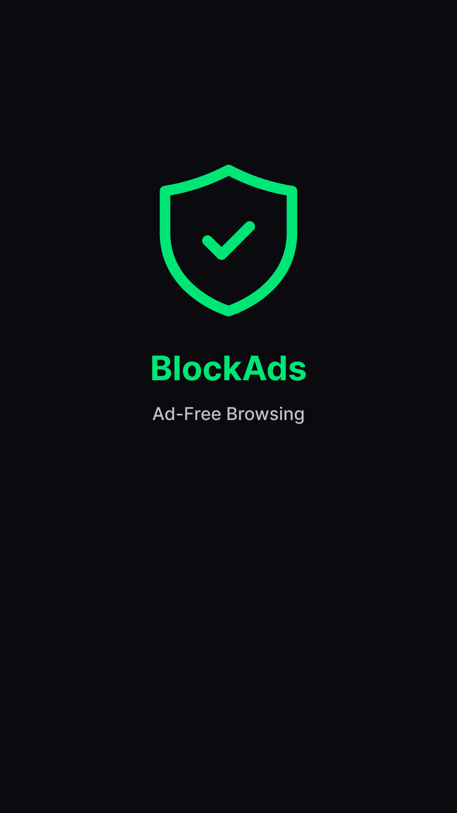
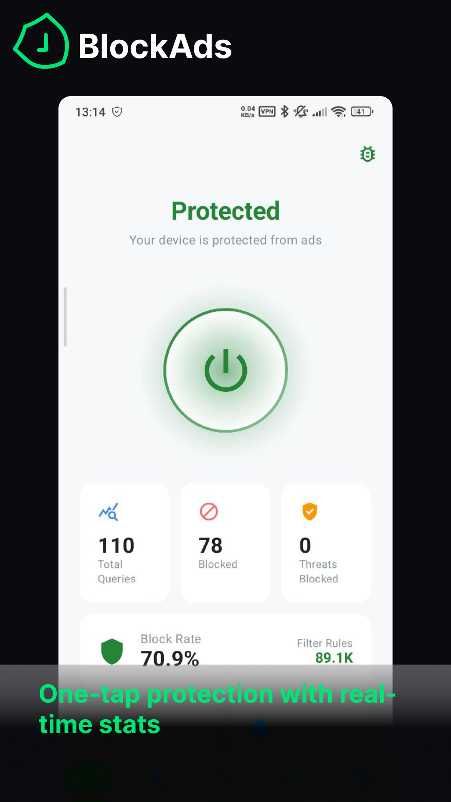
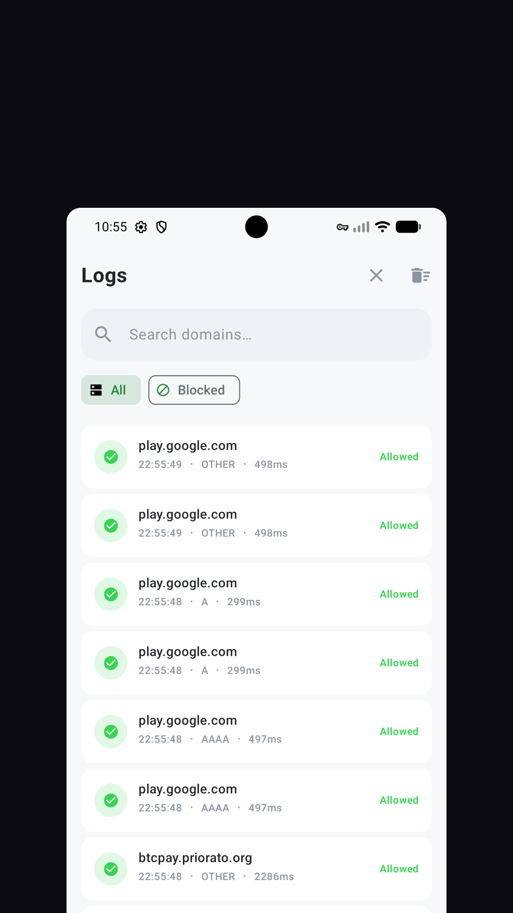
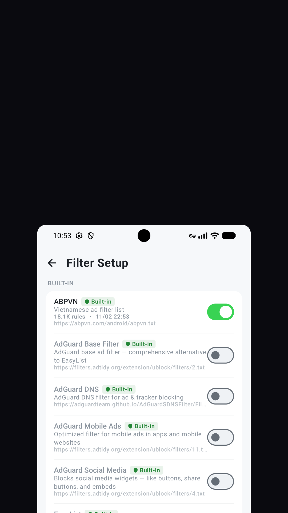
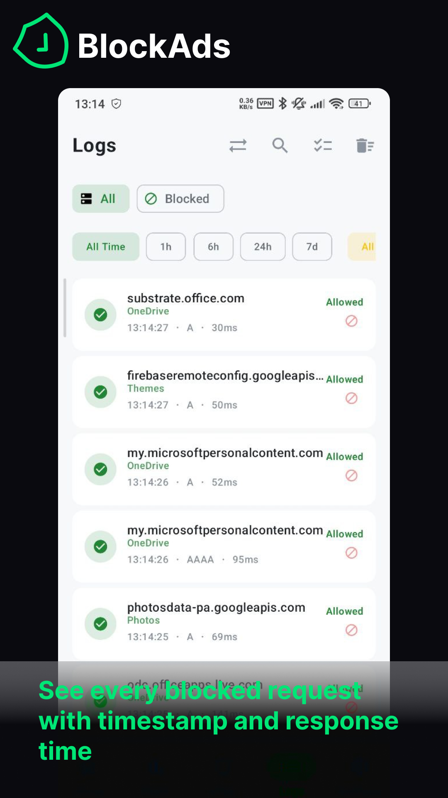
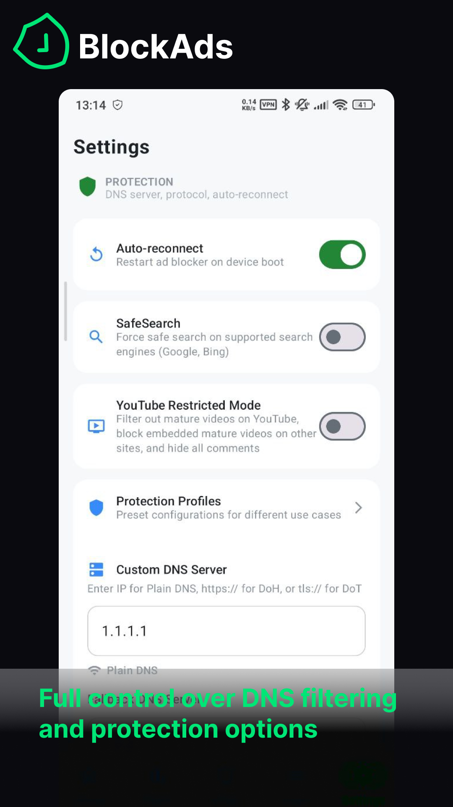

<div align="center">      
  
  <h1>BlockAds</h1>
  <p><strong>BlockAds</strong> is a free, open-source ad blocker for Android.</p>
<p>It blocks ads, trackers, and malware system-wide using local VPN-based DNS filtering — no root required, no data collection.</p>
<p>Built with Jetpack Compose and Material 3 for a modern, premium experience.</p>
  <br><br>
  <a href="https://github.com/pass-with-high-score/blockads-android/releases">
    
  </a>
  <a href="https://github.com/pass-with-high-score/blockads-android/releases">
    
  </a>
  <br><br>
  <h4>Download</h4>
  <a href="https://play.google.com/store/apps/details?id=app.pwhs.blockads">
    
  </a>
  <a href="https://github.com/pass-with-high-score/blockads-android/releases">
    
  </a>
</div> 

---  

## Screenshots

<div align="center">
  
  
  
  
  
  
</div>

---

## Features

* System-wide ad blocking via DNS filtering — no root needed
* Multiple built-in filter lists (StevenBlack, AdGuard DNS, EasyList, and more)
* Region-aware defaults — auto-enables filters for your language
* Real-time DNS query logs with search & filtering
* Security protection — blocks phishing, malware, and malvertising domains
* Dark / Light / System theme with Material 3 dynamic colors
* 7 accent color options + Material You dynamic theming
* Quick Settings tile & home screen widget
* Custom block/allow rules and whitelisting
* Per-app filtering (bypass VPN for selected apps)
* DNS-over-HTTPS (DoH) support with multiple providers
* Auto-update filter lists on schedule (6h / 12h / 24h / 48h)
* Export / Import settings backup
* Auto-reconnect on boot
* Multi-language support (English, Vietnamese, Japanese, Korean, Chinese, Thai, Spanish)
* 100% local — all data stays on your device

---  

## Community

Join our community:  
[](https://www.reddit.com/r/BlockAds/)
[](https://t.me/blockads_android)

## Sponsor

If you enjoy BlockAds, consider supporting the project! Your sponsorship helps us maintain and
improve the app.

[](https://github.com/sponsors/pass-with-high-score)

## Build Instructions

### Requirements

* [Android Studio](https://developer.android.com/studio) Ladybug or newer
* JDK 17 or higher
* Android SDK 36 (min SDK 24)

### Steps

1. Clone the repository:
   ```bash
   git clone https://github.com/pass-with-high-score/blockads-android.git 
   cd blockads-android 
   ```
2. Open the project in Android Studio

3. Sync Gradle and run the app on a device or emulator

4. Build from command line:
   ```bash
   ./gradlew assembleDebug
   ./gradlew bundleRelease   # requires signing key
   ```

---  

## How It Works

BlockAds creates a local VPN on your device. DNS queries are routed through it and matched against filter lists using a memory-efficient Trie data structure. Matching queries are blocked locally. All other traffic passes through normally — no data leaves your device.

---  

## License

This project is licensed under the **GNU General Public License v3.0**.  
You are free to use, modify, and distribute it under the terms of the license.  
See the full [LICENSE](LICENSE) file for details.

---  

## Credits

* Developed and maintained by [Nguyen Quang Minh](https://github.com/nqmgaming)
* Built with [Jetpack Compose](https://developer.android.com/jetpack/compose), [Koin](https://insert-koin.io/), and [Compose Destinations](https://github.com/raamcosta/compose-destinations)

---  

## Contributing

Pull requests and issue reports are welcome.  
Help us improve BlockAds!

### Help us translate BlockAds

Want to see BlockAds in your language?  
Open an issue or submit a PR with your translations.

---

## Star History

[](https://www.star-history.com/#pass-with-high-score/blockads-android&Date)
